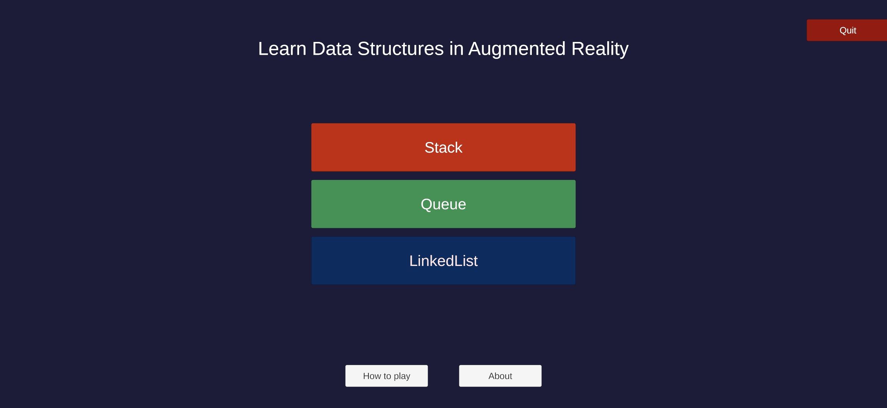
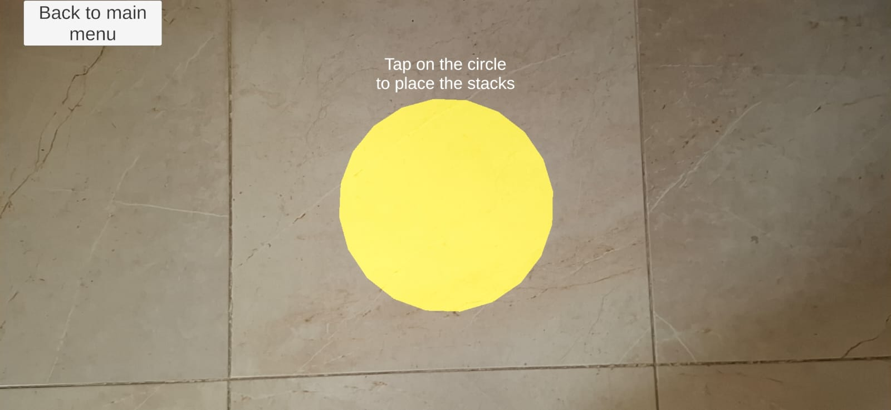
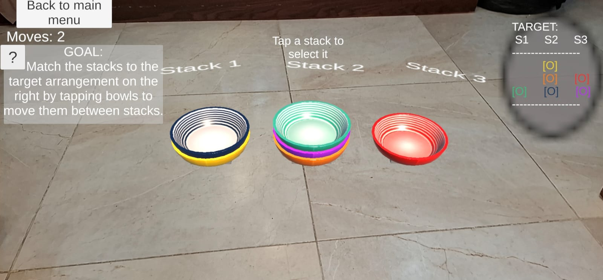
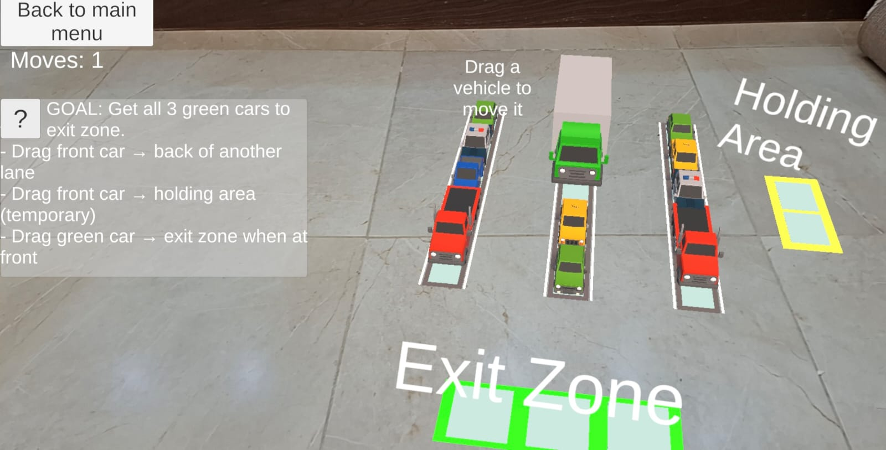
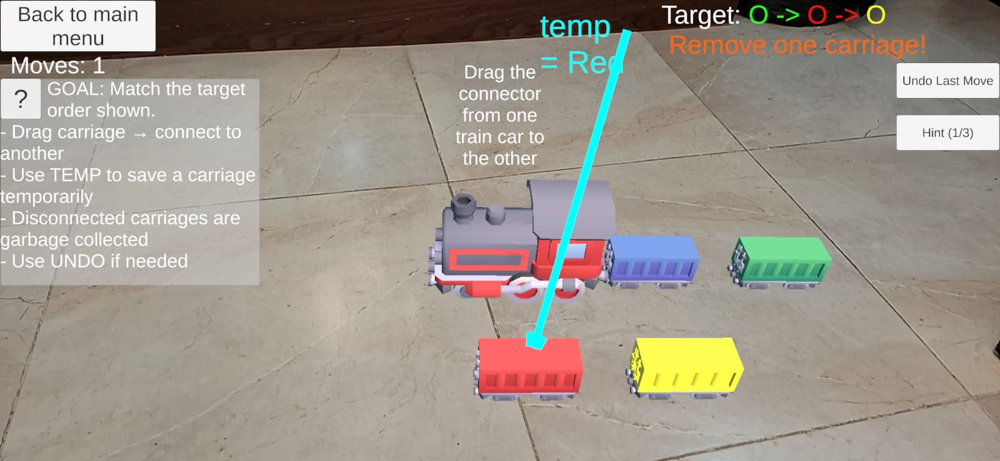
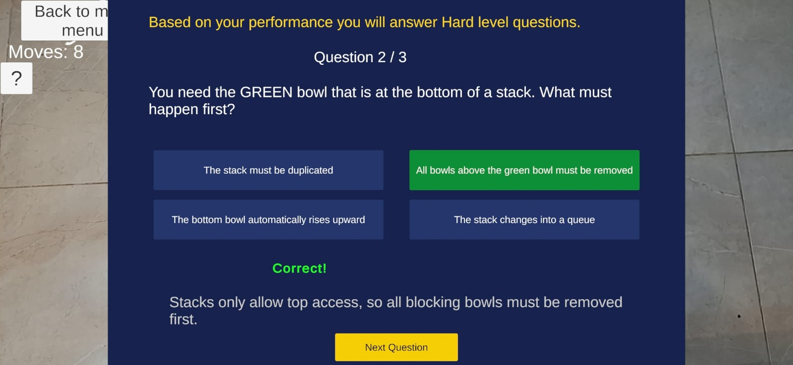

# AR Visualization for Computer Science Courses

> An Augmented Reality educational mobile application that teaches **Stack**, **Queue**, and **Linked List** data structures through interactive 3D gameplay.

---


## 📖 Overview

**ARforCS (Data Structures in Augmented Reality)** is an Android educational application developed as a Bachelor's Thesis at the **German University in Cairo (GUC)**.

The project combines **Augmented Reality (AR)**, **gamification**, and **adaptive assessment** to help students better understand abstract data structures through interactive learning experiences.

Instead of learning through static diagrams, students interact with virtual objects placed in their real-world environment, allowing them to visualize how data structures behave during different operations.

---

## ✨ Features

* 📱 Android Augmented Reality application
* 🌍 Markerless plane detection for AR placement
* 🖼️ Marker-based fallback placement mode
* 🥣 Interactive **Stack** module
* 🚗 Interactive **Queue** module
* 🚂 Interactive **Linked List** module
* 🎮 Gamified learning experience with story-driven scenarios
* 📝 Adaptive quiz system with immediate feedback
* 📊 Performance tracking based on gameplay statistics
* ↩️ Undo functionality and in-game hints

---

# 📸 Screenshots

## Main Menu



---

## AR Placement

Markerless plane detection with marker-based fallback support.



---

## Stack Module

Learn **Last-In-First-Out (LIFO)** behaviour through bowl stacking puzzles.



---

## Queue Module

Visualize **First-In-First-Out (FIFO)** operations using a parking lot scenario.



---

## Linked List Module

Understand node connections and pointer reassignment using train carriages.



---

## Adaptive Quiz

Performance-based quiz questions with immediate feedback.



---

## 🧠 Learning Modules

### 🥣 Stack

The Stack module teaches **LIFO (Last-In-First-Out)** behaviour through an interactive bowl-stacking game.

Students recreate target configurations by moving bowls between stacks, where every action directly corresponds to **Push** and **Pop** operations.

---

### 🚗 Queue

The Queue module represents queues using parking lanes and vehicles.

Players must free the target vehicle while respecting queue constraints, helping them understand **FIFO (First-In-First-Out)** behaviour through gameplay.

---

### 🚂 Linked List

The Linked List module uses train carriages as nodes and couplings as pointers.

Students manipulate pointer connections through drag-and-drop interactions and use a temporary pointer to perform more advanced operations.

The module also visualizes garbage collection by fading unreachable nodes.

---

## 🎯 Adaptive Quiz System

After each game, the application evaluates player performance using gameplay statistics, including:

* Move efficiency
* Invalid attempts
* Undo usage
* Constraint violations

Based on these statistics, players are assigned one of three difficulty levels:

* Basic
* Medium
* Hard

Three multiple-choice questions are then selected randomly from the corresponding question bank.

Immediate feedback and explanations are provided after every question to reinforce learning.

---

## 🛠️ Technologies Used

| Technology    | Purpose                     |
| ------------- | --------------------------- |
| Unity         | Game Engine                 |
| C#            | Application Development     |
| AR Foundation | Cross-platform AR framework |
| ARCore        | Android Augmented Reality   |
| TextMeshPro   | User Interface              |
| Git           | Version Control             |

---

## 📊 Evaluation

The application was evaluated using the **MEEGA+ Educational Game Evaluation Framework**.

**Participants**

* 20 undergraduate students
* German University in Cairo

### Key Results

| Dimension                | Mean         |
| ------------------------ | ------------ |
| Adapted AR Visualization | **4.65 / 5** |
| Relevance                | **4.53 / 5** |
| Fun                      | **4.28 / 5** |
| Satisfaction             | **4.25 / 5** |
| Usability                | **4.19 / 5** |
| Remembering Concepts     | **4.95 / 5** |
| Understanding Concepts   | **4.85 / 5** |
| Applying Concepts        | **4.85 / 5** |

The evaluation demonstrated positive usability, player experience, and perceived learning outcomes, suggesting that augmented reality can effectively support the teaching of fundamental data structures.

---

## 🚀 Installation

### Requirements

* Unity 6
* Android device with **ARCore** support

### Clone the repository

```bash
git clone https://github.com/Sara7549/DSAR.git
```

Open the project using Unity and build it for Android.

---

## 🔮 Future Work

Future improvements include:

* Binary Trees module
* Graph visualization
* Hash Tables
* Sorting and Searching Algorithms
* Multiplayer collaborative learning
* iOS support using ARKit
* AI-generated adaptive quiz questions
* Long-term learning analytics

---

## APK

📱 **[Download the latest APK here](https://github.com/Sara7549/AR-DSA-project/releases/latest)**

## 👩‍💻 Author

**Sara Mohamed Ihab**

Bachelor's Thesis

German University in Cairo

---

## 📄 License

This project was developed for educational and research purposes as part of a Bachelor's Thesis at the German University in Cairo.
